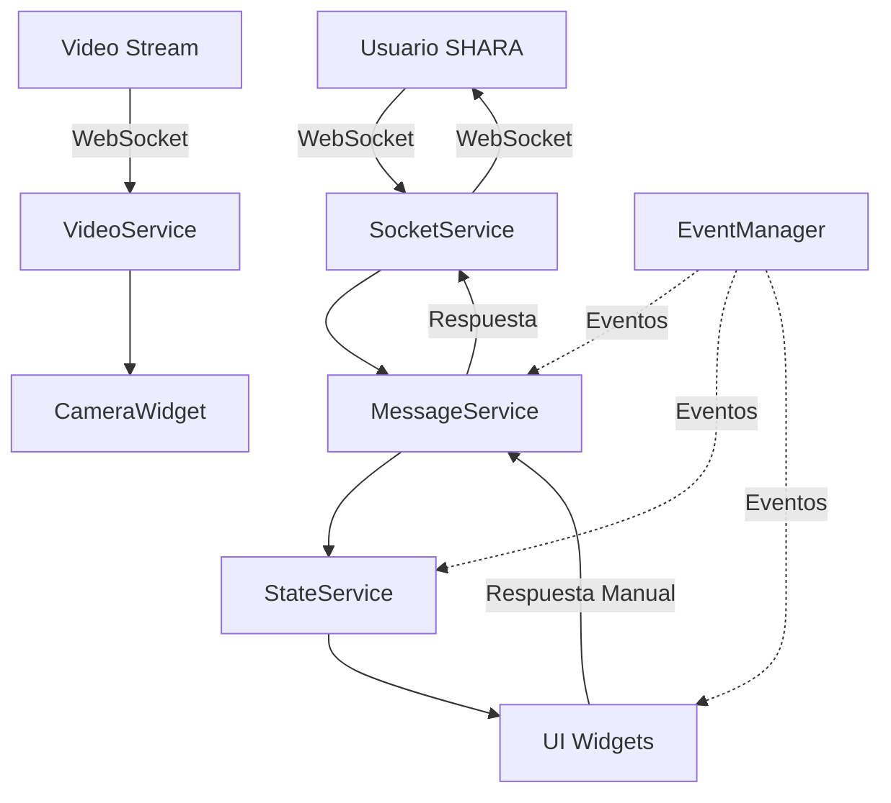

# SHARA Wizard of Oz Interface

Una aplicación PyQt6 para operar como interfaz de operador (Wizard of Oz) para el robot social SHARA, permitiendo supervisión y control manual/automático de las interacciones con usuarios.


## 🚀 Características Principales

### 💬 Interfaz de Chat Avanzada
- Chat en tiempo real con usuarios del sistema SHARA
- Modo manual y automático de operación
- Respuestas predefinidas por estado emocional
- Historial de conversaciones persistente

### 📹 Vista de Cámara en Tiempo Real
- Stream de video en vivo del usuario
- Reconexión automática en caso de pérdida de conexión
- Indicadores de estado de conexión y estadísticas

### 🌐 Navegador Web Integrado
- Vista de la interfaz web del usuario
- Gestión automática de errores de carga
- Soporte para ventanas emergentes

### 🤖 Gestión de Estados Emocionales
- 8 estados emocionales diferentes (Atención, Saludo, Sí, No, Alegría, Tristeza, Enfado, Rubor)
- Respuestas contextuales basadas en el estado
- Interfaz visual intuitiva para selección de estados

### 🔧 Arquitectura Moderna
- Patrón de servicios modulares
- Sistema de eventos centralizado
- Gestión robusta de errores
- Logging avanzado con rotación de archivos
- Validación completa de datos

## 📋 Requisitos del Sistema

### Software Requerido
- **Python 3.8+** (recomendado 3.9+)
- **PyQt6** con soporte para WebEngine
- **Conexión a Internet** estable

### Sistemas Operativos Soportados
- ✅ **Windows 10/11** (x64)
- ✅ **Linux** (Ubuntu 20.04+, Debian 11+, etc.)
- ✅ **macOS** (10.15+)

### Dependencias del Sistema

#### Ubuntu/Debian
```bash
sudo apt-get update
sudo apt-get install python3-pip python3-venv python3-pyqt6.qtwebengine
```

#### Windows
```bash
# No se requieren dependencias adicionales del sistema
# Todo se instala vía pip
```

#### macOS
```bash
# Instalar usando Homebrew (opcional)
brew install python@3.9
```

## 🛠️ Instalación

### Método 1: Instalación Automática (Recomendado)

```bash
# 1. Clonar el repositorio
git clone https://github.com/GuillermoCuberoCharco/ViSHARA/tree/main
cd wizard

# 2. Ejecutar el script de instalación
python setup.py
```

El script automáticamente:
- ✅ Verifica requisitos del sistema
- ✅ Crea entorno virtual
- ✅ Instala todas las dependencias
- ✅ Configura directorios necesarios
- ✅ Crea archivos de configuración
- ✅ Genera scripts de ejecución

### Método 2: Instalación Manual

```bash
# 1. Clonar el repositorio
git clone https://github.com/GuillermoCuberoCharco/ViSHARA/tree/main
cd wizard

# 2. Crear entorno virtual
python -m venv venv

# 3. Activar entorno virtual
# Windows:
venv\Scripts\activate
# Linux/macOS:
source venv/bin/activate

# 4. Instalar dependencias
pip install -r requirements.txt

# 5. Crear directorios necesarios
mkdir -p logs temp resources/icons data

# 6. Configurar entorno
cp .env.example .env
# Editar .env con tu configuración
```

## ⚙️ Configuración

### Archivo de Configuración (.env)

Copia `.env.example` a `.env` y configura los siguientes parámetros:

```bash
# URLs del servidor SHARA
SHARA_SERVER_URL=https://vishara.onrender.com
SHARA_WEB_URL=https://vi-shara.vercel.app

# Configuración de logging
LOG_LEVEL=INFO  # DEBUG, INFO, WARNING, ERROR, CRITICAL

# Configuración de interfaz
WINDOW_WIDTH=1400
WINDOW_HEIGHT=900
THEME=light  # light, dark

# Configuración de video
VIDEO_FPS=15
VIDEO_WIDTH=320
VIDEO_HEIGHT=240
```

### Configuración Avanzada

Para configuraciones más específicas, edita `config/settings.py`:

```python
# Ejemplo de configuración personalizada
settings.server.timeout = 15
settings.video.fps = 30
settings.logging.level = 'DEBUG'
```

## 🚀 Uso

### Ejecución

#### Usando Scripts Generados
```bash
# Windows
run_wizard.bat

# Linux/macOS
./run_wizard.sh
```

#### Ejecución Manual
```bash
# Activar entorno virtual primero
source venv/bin/activate  # Linux/macOS
# o
venv\Scripts\activate     # Windows

# Ejecutar aplicación
python main.py
```

### Modos de Operación

#### 🔧 Modo Manual
- Control total del operador sobre las respuestas
- Edición de mensajes antes de enviar
- Selección manual de estados emocionales
- Ideal para interacciones complejas o entrenamiento

#### 🤖 Modo Automático
- Respuestas automáticas basadas en IA (OpenAI)
- Procesamiento sin intervención humana
- Estados emocionales automáticos
- Ideal para operación continua

### Flujo de Trabajo Típico

1. **Inicio**: Abrir la aplicación y verificar conexión
2. **Detección**: Esperar detección automática de usuario
3. **Interacción**: 
   - **Manual**: Revisar respuestas de IA y aprobar/editar
   - **Automático**: Supervisar conversaciones automáticas
4. **Monitoreo**: Observar video del usuario y métricas
5. **Intervención**: Cambiar a manual si es necesario

## 🏗️ Arquitectura

### Estructura del Proyecto

```
shara-wizard/
├── main.py                 # Punto de entrada
├── requirements.txt        # Dependencias
├── setup.py               # Script de instalación
├── .env.example           # Configuración de ejemplo
├── README.md              # Documentación
│
├── config/                # Configuración
│   ├── __init__.py
│   ├── settings.py        # Configuración principal
│   └── constants.py       # Constantes de la aplicación
│
├── core/                  # Núcleo de la aplicación
│   ├── __init__.py
│   ├── app.py            # Aplicación principal
│   └── event_manager.py  # Sistema de eventos
│
├── models/               # Modelos de datos
│   ├── __init__.py
│   ├── user.py          # Modelo de usuario
│   ├── message.py       # Modelo de mensaje
│   └── session.py       # Modelo de sesión
│
├── services/            # Servicios de negocio
│   ├── __init__.py
│   ├── socket_service.py    # Comunicación WebSocket
│   ├── message_service.py   # Lógica de mensajería
│   ├── video_service.py     # Gestión de video
│   └── state_service.py     # Estado global
│
├── ui/                  # Interfaz de usuario
│   ├── __init__.py
│   ├── main_window.py       # Ventana principal
│   ├── widgets/             # Widgets personalizados
│   ├── dialogs/             # Diálogos
│   └── styles/              # Estilos y temas
│
├── utils/               # Utilidades
│   ├── __init__.py
│   ├── logger.py            # Sistema de logging
│   └── validators.py        # Validadores
│
└── resources/           # Recursos
    └── icons/               # Iconos de la aplicación
```

### Patrones de Diseño Utilizados

- **🎯 Patrón Observer**: Sistema de eventos centralizado
- **🏭 Factory Pattern**: Creación de mensajes y modelos
- **🚀 Service Layer**: Separación de lógica de negocio
- **📋 Repository Pattern**: Gestión de datos de sesiones
- **🔄 Command Pattern**: Manejo de acciones de usuario

### Flujo de Datos



## 🔧 Desarrollo

### Configuración del Entorno de Desarrollo

```bash
# Clonar repositorio
git clone https://github.com/GuillermoCuberoCharco/ViSHARA/tree/main
cd wizard-interface

# Instalar en modo desarrollo
pip install -e .

# Instalar dependencias de desarrollo
pip install pytest pytest-qt black flake8 mypy

# Configurar pre-commit hooks (opcional)
pre-commit install
```

### Estructura de Testing

```bash
# Ejecutar tests
pytest tests/

# Ejecutar con cobertura
pytest --cov=. tests/

# Tests específicos de UI
pytest tests/ui/ --qt-no-capture
```

### Estándares de Código

- **Formateo**: Black (automatizado)
- **Linting**: Flake8
- **Type Checking**: MyPy
- **Documentación**: Google Style Docstrings

### Contribuir

1. 🍴 Fork el repositorio
2. 🌿 Crear rama de feature (`git checkout -b feature/amazing-feature`)
3. 💾 Commit cambios (`git commit -m 'Add amazing feature'`)
4. 📤 Push a la rama (`git push origin feature/amazing-feature`)
5. 🔍 Abrir Pull Request

## 📊 Monitoreo y Logs

### Sistema de Logging

La aplicación incluye un sistema de logging:

```
logs/
├── shara_wizard.log         # Log principal (rotativo)
├── shara_wizard_errors.log  # Solo errores
└── session_*.log           # Logs por sesión
```

### Niveles de Log

- **DEBUG**: Información detallada para desarrollo
- **INFO**: Información general de operación
- **WARNING**: Advertencias que no afectan la operación
- **ERROR**: Errores que afectan funcionalidad específica
- **CRITICAL**: Errores críticos que pueden terminar la aplicación

### Métricas Disponibles

- 📈 Mensajes enviados/recibidos
- 👥 Usuarios detectados
- 💬 Sesiones creadas
- 🔄 Reconexiones de video/socket
- ⏱️ Tiempos de respuesta

## 🔒 Seguridad

### Consideraciones de Seguridad

- ✅ **Validación de entrada**: Todos los datos son validados
- ✅ **Sanitización**: Prevención de inyección de código
- ✅ **HTTPS**: Comunicación segura con servidores
- ✅ **Timeouts**: Prevención de conexiones colgadas
- ✅ **Rate limiting**: Control de frecuencia de mensajes

### Mejores Prácticas

- 🔐 Usar HTTPS en producción
- 🔑 No hardcodear credenciales
- 🛡️ Mantener dependencias actualizadas
- 📝 Revisar logs regularmente
- 🔄 Backup de configuraciones importantes

## ❓ Solución de Problemas

### Problemas Comunes

#### 🔌 Error de Conexión al Servidor
```bash
# Verificar conectividad
curl -I https://vishara.onrender.com

# Revisar configuración
cat .env | grep SERVER_URL

# Verificar logs
tail -f logs/shara_wizard.log
```

#### 📹 Video No Se Muestra
```bash
# Verificar dependencias de video
pip install opencv-python

# Verificar permisos de red
# Asegurar que el puerto de video esté abierto
```

#### 🐍 Errores de PyQt6
```bash
# Linux: Instalar dependencias del sistema
sudo apt-get install python3-pyqt6.qtwebengine

# Windows: Reinstalar PyQt6
pip uninstall PyQt6
pip install PyQt6
```

#### 📄 Archivos de Log Muy Grandes
```bash
# Configurar rotación en .env
LOG_MAX_BYTES=5242880  # 5MB
LOG_BACKUP_COUNT=3

# Limpiar logs manualmente
rm logs/*.log
```

### Logs de Debugging

Para obtener información detallada de debugging:

```bash
# Configurar nivel DEBUG
export LOG_LEVEL=DEBUG

# Ejecutar con verbose
python main.py --verbose

# Verificar logs específicos
tail -f logs/shara_wizard.log | grep ERROR
```

### Contacto y Soporte

- 📧 **Email**: Guillermo.Cubero@uclm.es

## 📜 Licencia

Este proyecto está licenciado bajo la Licencia MIT - ver el archivo [LICENSE](LICENSE) para detalles.

## 🙏 Agradecimientos

- Equipo de desarrollo SHARA MAmI Lab
- Comunidad PyQt6
- Contribuidores open source
- Universidad de Castilla-La Mancha

## 🔄 Historial de Versiones

### v2.0.0 (Actual)
- ✨ Refactorización completa de la arquitectura
- 🚀 Nueva interfaz moderna con PyQt6
- 🤖 Integración con OpenAI para respuestas automáticas
- 📹 Mejor gestión de video en tiempo real
- 🔧 Sistema de configuración mejorado
- 📊 Logging y monitoreo avanzados
- 🛡️ Validación robusta de datos
- 🎨 Sistema de temas y estilos

### v1.x (Legacy)
- Versión anterior con arquitectura básica
- Soporte limitado para extensibilidad

---

**¡Gracias por usar SHARA Wizard of Oz Interface!** 🎉
