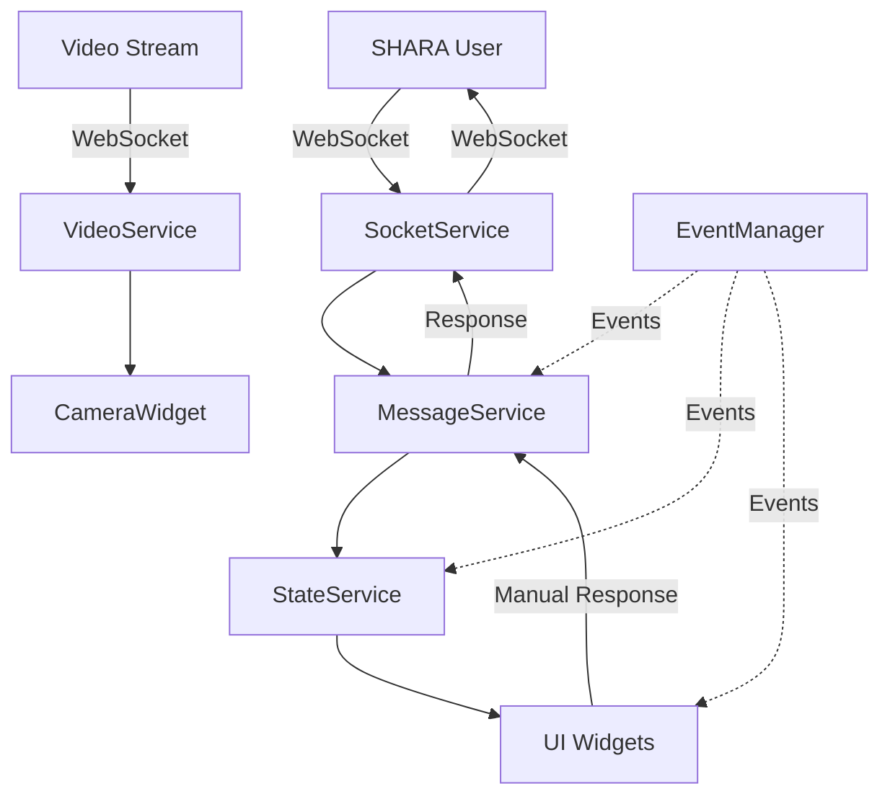

Readme · MD
Copiar

# SHARA Wizard of Oz Interface

A PyQt6 application to operate as an operator interface (Wizard of Oz) for the SHARA social robot, allowing supervision and manual/automatic control of user interactions.

## 🚀 Main Features

### 💬 Advanced Chat Interface
- Real-time chat with SHARA system users
- Manual and automatic operation modes
- Predefined responses by emotional state
- Persistent conversation history

### 📹 Real-Time Camera View
- Live video stream from the user
- Automatic reconnection in case of connection loss
- Connection status indicators and statistics

### 🌐 Integrated Web Browser
- User web interface view
- Automatic error management for loading
- Support for pop-up windows

### 🤖 Emotional State Management
- 8 different emotional states (Attention, Greeting, Yes, No, Joy, Sadness, Anger, Blush)
- Contextual responses based on state
- Intuitive visual interface for state selection

### 🔧 Modern Architecture
- Modular service pattern
- Centralized event system
- Robust error handling
- Advanced logging with file rotation
- Complete data validation

## 📋 System Requirements

### Required Software
- **Python 3.8+** (recommended 3.9+)
- **PyQt6** with WebEngine support
- Stable **Internet Connection**

### Supported Operating Systems
- ✅ **Windows 10/11** (x64)
- ✅ **Linux** (Ubuntu 20.04+, Debian 11+, etc.)
- ✅ **macOS** (10.15+)

### System Dependencies

#### Ubuntu/Debian
```bash
sudo apt-get update
sudo apt-get install python3-pip python3-venv python3-pyqt6.qtwebengine
```

#### Windows
```bash
# No additional system dependencies required
# Everything is installed via pip
```

#### macOS
```bash
# Install using Homebrew (optional)
brew install python@3.9
```

## 🛠️ Installation

### Method 1: Automatic Installation (Recommended)

```bash
# 1. Clone the repository
git clone https://github.com/GuillermoCuberoCharco/ViSHARA/tree/main
cd wizard

# 2. Run the installation script
python setup.py
```

The script automatically:
- ✅ Verifies system requirements
- ✅ Creates virtual environment
- ✅ Installs all dependencies
- ✅ Configures necessary directories
- ✅ Creates configuration files
- ✅ Generates execution scripts

### Method 2: Manual Installation

```bash
# 1. Clone the repository
git clone https://github.com/GuillermoCuberoCharco/ViSHARA/tree/main
cd wizard

# 2. Create virtual environment
python -m venv venv

# 3. Activate virtual environment
# Windows:
venv\Scripts\activate
# Linux/macOS:
source venv/bin/activate

# 4. Install dependencies
pip install -r requirements.txt

# 5. Create necessary directories
mkdir -p logs temp resources/icons data

# 6. Configure environment
cp .env.example .env
# Edit .env with your configuration
```

## ⚙️ Configuration

### Configuration File (.env)

Copy `.env.example` to `.env` and configure the following parameters:

```bash
# SHARA server URLs
SHARA_SERVER_URL=https://vishara.onrender.com
SHARA_WEB_URL=https://vi-shara.vercel.app

# Logging configuration
LOG_LEVEL=INFO  # DEBUG, INFO, WARNING, ERROR, CRITICAL

# Interface configuration
WINDOW_WIDTH=1400
WINDOW_HEIGHT=900
THEME=light  # light, dark

# Video configuration
VIDEO_FPS=15
VIDEO_WIDTH=320
VIDEO_HEIGHT=240
```

### Advanced Configuration

For more specific configurations, edit `config/settings.py`:

```python
# Example of custom configuration
settings.server.timeout = 15
settings.video.fps = 30
settings.logging.level = 'DEBUG'
```

## 🚀 Usage

### Execution

#### Using Generated Scripts
```bash
# Windows
run_wizard.bat

# Linux/macOS
./run_wizard.sh
```

#### Manual Execution
```bash
# Activate virtual environment first
source venv/bin/activate  # Linux/macOS
# or
venv\Scripts\activate     # Windows

# Run application
python main.py
```

### Operation Modes

#### 🔧 Manual Mode
- Full operator control over responses
- Message editing before sending
- Manual selection of emotional states
- Ideal for complex interactions or training

#### 🤖 Automatic Mode
- Automatic AI-based responses (OpenAI)
- Processing without human intervention
- Automatic emotional states
- Ideal for continuous operation

### Typical Workflow

1. **Startup**: Open the application and verify connection
2. **Detection**: Wait for automatic user detection
3. **Interaction**: 
   - **Manual**: Review AI responses and approve/edit
   - **Automatic**: Monitor automatic conversations
4. **Monitoring**: Observe user video and metrics
5. **Intervention**: Switch to manual if necessary

## 🏗️ Architecture

### Project Structure

```
shara-wizard/
├── main.py                 # Entry point
├── requirements.txt        # Dependencies
├── setup.py               # Installation script
├── .env.example           # Example configuration
├── README.md              # Documentation
│
├── config/                # Configuration
│   ├── __init__.py
│   ├── settings.py        # Main configuration
│   └── constants.py       # Application constants
│
├── core/                  # Application core
│   ├── __init__.py
│   ├── app.py            # Main application
│   └── event_manager.py  # Event system
│
├── models/               # Data models
│   ├── __init__.py
│   ├── user.py          # User model
│   ├── message.py       # Message model
│   └── session.py       # Session model
│
├── services/            # Business services
│   ├── __init__.py
│   ├── socket_service.py    # WebSocket communication
│   ├── message_service.py   # Messaging logic
│   ├── video_service.py     # Video management
│   └── state_service.py     # Global state
│
├── ui/                  # User interface
│   ├── __init__.py
│   ├── main_window.py       # Main window
│   ├── widgets/             # Custom widgets
│   ├── dialogs/             # Dialogs
│   └── styles/              # Styles and themes
│
├── utils/               # Utilities
│   ├── __init__.py
│   ├── logger.py            # Logging system
│   └── validators.py        # Validators
│
└── resources/           # Resources
    └── icons/               # Application icons
```

### Design Patterns Used

- **🎯 Observer Pattern**: Centralized event system
- **🏭 Factory Pattern**: Creation of messages and models
- **🚀 Service Layer**: Separation of business logic
- **📋 Repository Pattern**: Session data management
- **🔄 Command Pattern**: User action handling

### Data Flow



## 🔧 Development

### Development Environment Setup

```bash
# Clone repository
git clone https://github.com/GuillermoCuberoCharco/ViSHARA/tree/main
cd wizard-interface

# Install in development mode
pip install -e .

# Install development dependencies
pip install pytest pytest-qt black flake8 mypy

# Configure pre-commit hooks (optional)
pre-commit install
```

### Testing Structure

```bash
# Run tests
pytest tests/

# Run with coverage
pytest --cov=. tests/

# UI-specific tests
pytest tests/ui/ --qt-no-capture
```

### Code Standards

- **Formatting**: Black (automated)
- **Linting**: Flake8
- **Type Checking**: MyPy
- **Documentation**: Google Style Docstrings

### Contributing

1. 🍴 Fork the repository
2. 🌿 Create feature branch (`git checkout -b feature/amazing-feature`)
3. 💾 Commit changes (`git commit -m 'Add amazing feature'`)
4. 📤 Push to branch (`git push origin feature/amazing-feature`)
5. 🔍 Open Pull Request

## 📊 Monitoring and Logs

### Logging System

The application includes a comprehensive logging system:

```
logs/
├── shara_wizard.log         # Main log (rotating)
├── shara_wizard_errors.log  # Errors only
└── session_*.log           # Per-session logs
```

### Log Levels

- **DEBUG**: Detailed information for development
- **INFO**: General operational information
- **WARNING**: Warnings that don't affect operation
- **ERROR**: Errors affecting specific functionality
- **CRITICAL**: Critical errors that may terminate the application

### Available Metrics

- 📈 Messages sent/received
- 👥 Users detected
- 💬 Sessions created
- 🔄 Video/socket reconnections
- ⏱️ Response times

## 🔒 Security

### Security Considerations

- ✅ **Input validation**: All data is validated
- ✅ **Sanitization**: Code injection prevention
- ✅ **HTTPS**: Secure communication with servers
- ✅ **Timeouts**: Prevention of hanging connections
- ✅ **Rate limiting**: Message frequency control

### Best Practices

- 🔐 Use HTTPS in production
- 🔑 Don't hardcode credentials
- 🛡️ Keep dependencies updated
- 📝 Review logs regularly
- 🔄 Backup important configurations

## ❓ Troubleshooting

### Common Issues

#### 🔌 Server Connection Error
```bash
# Verify connectivity
curl -I https://vishara.onrender.com

# Check configuration
cat .env | grep SERVER_URL

# Check logs
tail -f logs/shara_wizard.log
```

#### 📹 Video Not Displaying
```bash
# Verify video dependencies
pip install opencv-python

# Check network permissions
# Ensure video port is open
```

#### 🐍 PyQt6 Errors
```bash
# Linux: Install system dependencies
sudo apt-get install python3-pyqt6.qtwebengine

# Windows: Reinstall PyQt6
pip uninstall PyQt6
pip install PyQt6
```

#### 📄 Log Files Too Large
```bash
# Configure rotation in .env
LOG_MAX_BYTES=5242880  # 5MB
LOG_BACKUP_COUNT=3

# Clean logs manually
rm logs/*.log
```

### Debugging Logs

To get detailed debugging information:

```bash
# Configure DEBUG level
export LOG_LEVEL=DEBUG

# Run with verbose
python main.py --verbose

# Check specific logs
tail -f logs/shara_wizard.log | grep ERROR
```

### Contact and Support

- 📧 **Email**: Guillermo.Cubero@uclm.es

## 📜 License

This project is licensed under the MIT License - see the [LICENSE](LICENSE) file for details.

## 🙏 Acknowledgments

- SHARA MAmI Lab development team
- PyQt6 community
- Open source contributors
- University of Castilla-La Mancha

## 🔄 Version History

### v2.0.0 (Current)
- ✨ Complete architecture refactoring
- 🚀 New modern interface with PyQt6
- 🤖 OpenAI integration for automatic responses
- 📹 Improved real-time video management
- 🔧 Enhanced configuration system
- 📊 Advanced logging and monitoring
- 🛡️ Robust data validation
- 🎨 Theme and style system

### v1.x (Legacy)
- Previous version with basic architecture
- Limited extensibility support

---

**Thank you for using SHARA Wizard of Oz Interface!** 🎉